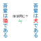

#  Sentence Similarity **flow**ground Connector

## Description

A generated **flow**ground connector for the Sentence Similarity API (version 0.0.1).

Generated from: https://api.apis.guru/v2/specs/apitore.com/sentenceSimilarity/0.0.1/swagger.json 
Generated at: 2019-05-07T17:36:42+03:00

## API Description

Sentence Similarity. [Endpoint] https://api.apitore.com/api/53

## Authorization

This API does not require authorization.

## Actions

### Text similarity using word2vec

> Sentence similarity. Response &nbsp; Github: <a href="https://github.com/keigohtr/apitore-response-parent/tree/master/text-similarity-response">text-similarity-response</a> &nbsp; Class: com.apitore.banana.response.textsimilarity.TextSimilarityResponseEntity 

*Tags:* `sentence-similarity-controller`

#### Input Parameters
* `access_token` - _required_ - Access Token

## License

**flow**ground :- Telekom iPaaS / apitore-com-sentence-similarity-connector 
Copyright © 2019, [Deutsche Telekom AG](https://www.telekom.de) 
contact: flowground@telekom.de

All files of this connector are licensed under the Apache 2.0 License. For details
see the file LICENSE on the toplevel directory.
